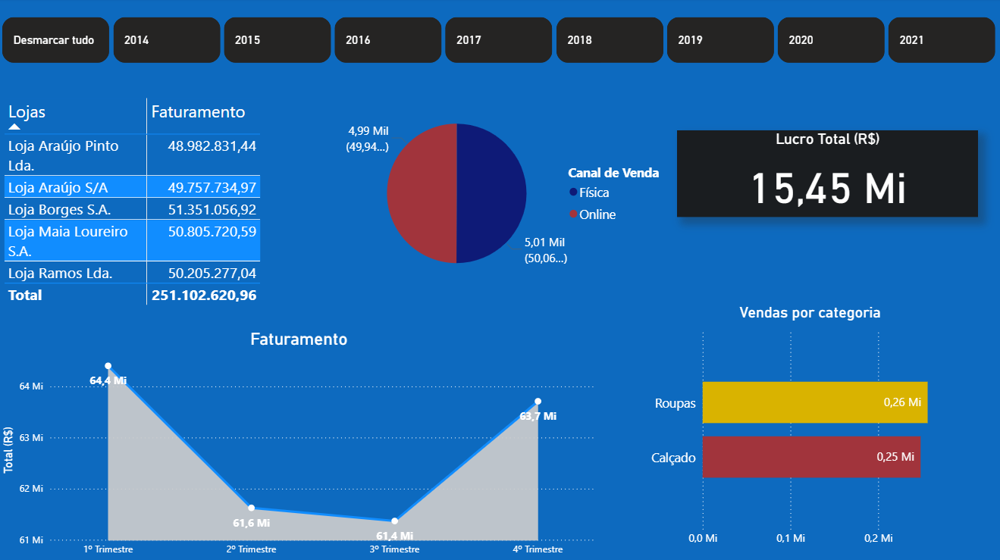

# 📊 Projeto de Análise de Vendas no Varejo

Este repositório contém um projeto completo de análise de dados de vendas no varejo, incluindo um processo de ETL em Python e um dashboard interativo construído no Power BI.

---

## 🧰 Tecnologias Utilizadas

- Python 3 (ETL com Pandas)
- Jupyter Notebook
- Power BI (.pbix)
- Git & GitHub

---

## Fonte dos dados

- Kaggle Dataset

---

## 🔄 Processo ETL

O arquivo `ETL.ipynb` contém o pipeline de ETL responsável por:

- **Extração** de dados de fontes internas.
- **Limpeza e transformação** dos dados para padronização.
- **Geração de datasets prontos** para visualização no Power BI.

## 🖼️ Capturas de Tela

Abaixo está um exemplo do dashboard criado no Power BI:



> 💡 Para executar o ETL:
```bash
jupyter notebook ETL.ipynb

---

📦 Projeto-Vendas-Varejo
├── ETL.ipynb
├── README.md
└── assets/
    └── dashboard-principal.png

